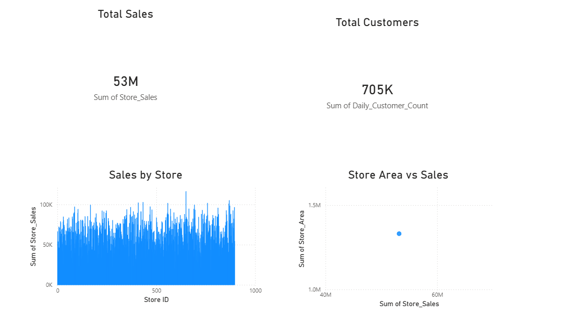

# Sales Dashboard Project

## 📊 Tools Used
- Power BI
- Excel

## 📁 Dataset
- Store ID
- Store Area
- Items Available
- Daily Customer Count
- Store Sales

## 📈 Dashboard Insights
- Total Sales: 53M
- Total Customers: 705K
- Sales by Store
- Store Area vs Sales

## 📷 Dashboard Preview

## 💡 Key Learnings
- Data visualization using Power BI
- Creating KPI cards and charts
- Understanding business insights
